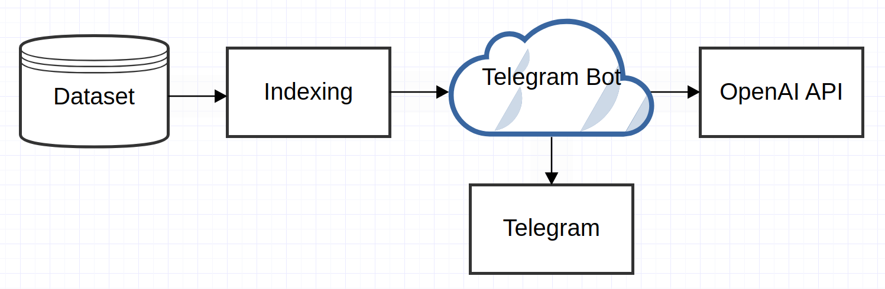
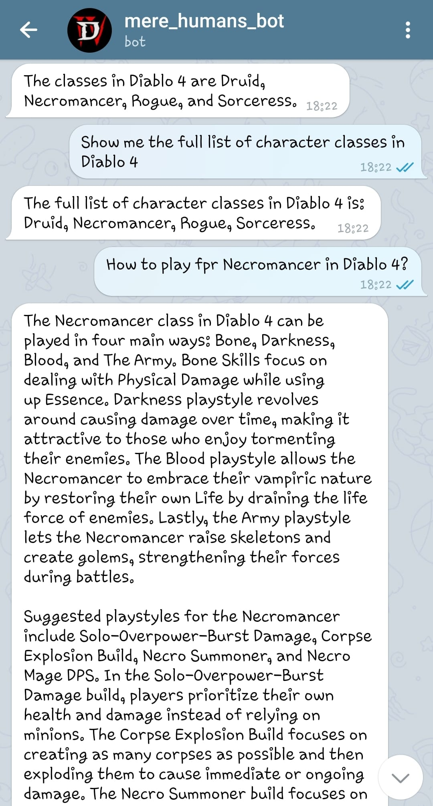

# flowgpt_hackathon

## Challenge: Domain expert AI assistant
The challenge is to feed a private data set to the model to fine-tune it to
make it a useful assistant including the private data set. 
The user should be able to have a conversation - ideally integrated into a
chat tool (like telegram or whatsapp) with the model on the domain specific
model either by text or voice.

## Solution

Solution implemented in following steps:
* Build vector index for custom dataset (incorporating LLM predictor from LangChain)
* Instantiate Query Engine (which incorporates composed graph based on our data index)
* Integrate Query Engine with Telegram Bot and/or Gradio Http

Dependencies on openAI APIs:
* embedded API (to build vector embedding)
* chat API

Solution stats

* Test Dataset URL: https://diablo4.wiki.fextralife.com/Diablo+4+Wiki
* Site Snapshot Raw Size: 404.9 Mb
* Site Snapshot Stripped Size: 34.9 Mb
* Llama Index size: 519.8 Mb
* OpenAI Cost: $5.55

### Project Expansion and Upcoming Ideas

* Index Merge.
The most recent updates/news/etc in domain area are the most relevant and desired to be obtained from the assistant.
* On-prem LLM. To prevent private dataset leak.

### Setup
* <code>git clone https://github.com/dmitnin/flowgpt-hackathon.git</code>
* <code>pip install -r requirements.txt</code>
* <code>playwright install</code> (for web knowledge base crawler)

### References
* https://gpt-index.readthedocs.io/en/latest/
* https://www.mikulskibartosz.name/llama-index-which-index-should-you-use/